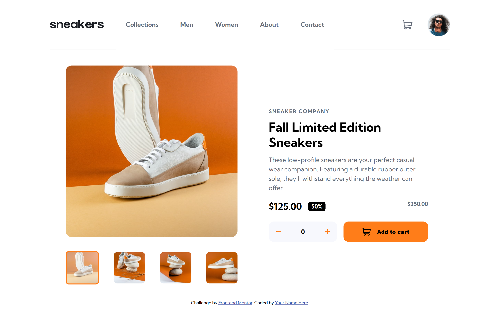

# Frontend Mentor - E-commerce product page solution

This is a solution to the [E-commerce product page challenge on Frontend Mentor](https://www.frontendmentor.io/challenges/ecommerce-product-page-UPsZ9MJp6). Frontend Mentor challenges help you improve your coding skills by building realistic projects.

## Table of contents

- [Overview](#overview)
  - [The challenge](#the-challenge)
  - [Screenshot](#screenshot)
  - [Links](#links)
- [My process](#my-process)
  - [Built with](#built-with)
  - [What I learned](#what-i-learned)
  - [Continued development](#continued-development)
  - [AI Collaboration](#ai-collaboration)
- [Author](#author)
- [Acknowledgments](#acknowledgments)

## Overview

### The challenge

Users should be able to:

- View the optimal layout for the site depending on their device's screen size
- See hover states for all interactive elements on the page
- Open a lightbox gallery by clicking on the large product image
- Switch the large product image by clicking on the small thumbnail images
- Add items to the cart.
- View the cart and remove items from it

### Screenshot

### Links

- Solution URL: [Solution here](https://github.com/nqbinh98/ecommerce-product-page)
- Live Site URL: [Live site](https://nqbinh98.github.io/ecommerce-product-page/)

## My process

### Built with

- Semantic HTML5 markup
- CSS custom properties
- Flexbox
- CSS Grid
- Mobile-first workflow

### What I learned
- Learned how to structure a responsive layout using modern CSS Flexbox and Grid.
- Improved skills in handling component-based states (like navigation menus and shopping cart toggles) with clean CSS and JavaScript.
- Understood how to manage vertical alignment and spacing consistency across different screen sizes.

### Continued development
- Implement full JavaScript interactivity for the shopping cart (adding, removing items, and calculating totals).
- Optimize accessibility (ARIA attributes) and keyboard navigation for mobile menus and interactive components.
- Refactor and modularize CSS code using preprocessors or better architectural patterns.

### AI Collaboration
- Utilized AI as a technical partner to debug CSS layout issues, specifically targeting vertical alignment and positioning contexts.
- Collaborated on refining best practices for responsive design and maintaining clean, maintainable code structures.

## Author
- Website - [@nqbinh98](https://github.com/nqbinh98)
- Frontend Mentor - [@nqbinh98](https://www.frontendmentor.io/profile/nqbinh98)

## Acknowledgments
A special thanks to anyone whose code or advice helped me during this project, and to the community for continuous inspiration and feedback.
